# Delay Dashboard — User Manual

This manual walks through the Delay Dashboard screen by screen, for anyone using it for the first time.

> The screenshots show an earlier design of the app, so some names and layouts in them differ from what you will see. The names in the text are the current ones.

The screenshots use real data from Hiroshima Electric Railway. Every agency’s screens work the same way; where a report needs data that an agency’s feed does not send, the screen says so.

---

## Table of contents

1. [Choosing an agency](#1-choosing-an-agency)
2. [Finding your way around](#2-finding-your-way-around)
3. [The scope sentence: what a screen shows](#3-the-scope-sentence-what-a-screen-shows)
4. [Pulse — how service is running](#4-pulse--how-service-is-running)
5. [Routes — which routes run late](#5-routes--which-routes-run-late)
6. [Time — when delay happens](#6-time--when-delay-happens)
7. [Why — what the data can explain](#7-why--what-the-data-can-explain)
8. [Compare — side by side](#8-compare--side-by-side)
9. [Live — the trips running now](#9-live--the-trips-running-now)
10. [Reports — documents to hand on](#10-reports--documents-to-hand-on)
11. [Ask — questions with ready answers](#11-ask--questions-with-ready-answers)

---

## 1. Choosing an agency

When you open the app, it first asks which agency (bus or rail operator) you want to look at.

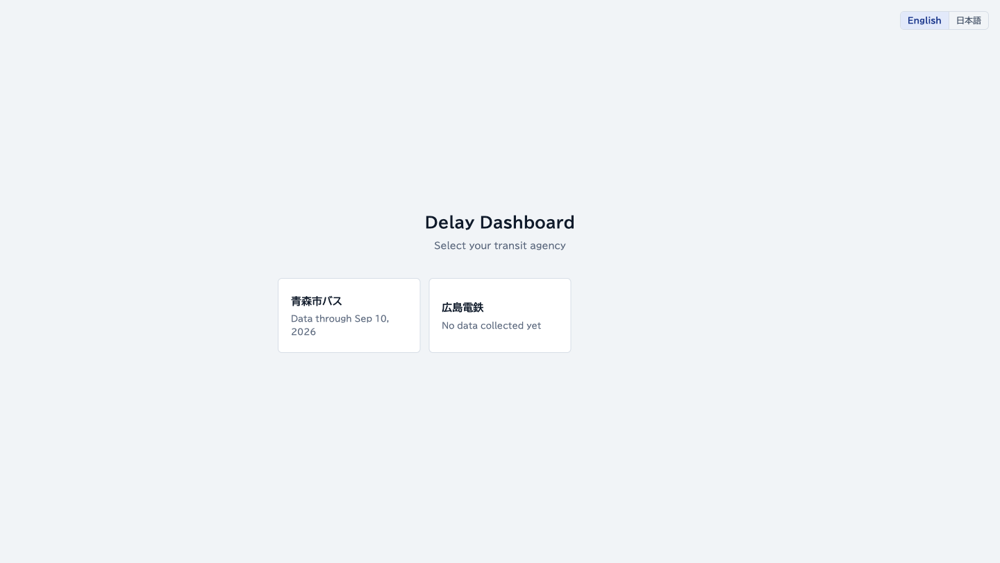

- Each card shows the agency’s name and how far its data reaches (“Data through …”). An agency whose data has not started arriving reads “No data collected yet”. Agencies with data are listed first.
- When there are many agencies, a “Search agencies” box appears above the cards.
- The language switch in the top-right corner changes the display language.

Click a card to open that agency’s **Pulse** screen (section 4). The app remembers your choice: the next time you open it, it goes straight to that agency’s Pulse. When only one agency is set up, this screen is skipped.

### Switching agencies

Open the agency menu at the top of the sidebar (the agency’s name with ▾), type part of a name to narrow the list, and pick another agency. You stay on the same screen, now for the new agency. From a route’s page you land on the **Routes** list instead, because routes belong to one agency. On a phone, the agency menu is under **More**.

You can also type an agency’s name into the search field at the top of the screen (section 2).

---

## 2. Finding your way around

### The sidebar

The sidebar on the left lists the screens. Each one answers one kind of question.

| Screen | What it answers |
|---|---|
| **Pulse** | How service ran over the period, and what changed |
| **Routes** | Which routes run late or on time, and how one route looks stop by stop |
| **Time** | When delay happens: by day, by hour and by day of the week |
| **Why** | Where the time goes: waiting at stops or running between them |
| **Compare** | Weekdays against weekends route by route, and agencies against each other |
| **Live** | The trips running now |
| **Reports** | Pages to print or hand on: a period summary, a council report, a delay certificate |
| **Ask** | Ready-made questions, answered as tables and charts |

Under **Other** are **Help** (this manual) and **About this app**. The arrow next to the app’s name collapses the sidebar to icons; hover over an icon to see its name.

The account menu at the bottom of the sidebar (your name, or **Guest**) holds sign-in, the display **Language** and the **Appearance** (follow the system, light or dark).

### Searching and jumping

The field at the top of every agency screen, “Search routes, reports and screens”, opens a search box (shortcut ⌘K, or Ctrl+K). Type to jump to a screen, an agency, a route, a report or a time band.

Next to it, “Analyzed through …” shows the last service day the reports include. Click it to see “How fresh the data is”: how far the reports reach, when the last live reading arrived, and how many readings were set aside as implausible. Days without readings are left out, not counted as on time.

### On a phone

On a narrow screen the sidebar becomes a bar along the bottom with **Pulse**, **Routes**, **Live**, **Ask** and **More**. **More** holds the agency menu, the other screens, Help and the account menu.

### Notices at the top

On Pulse, Routes, Time, Why and Compare, a notice can appear above the screen:

- “Data is out of date — last ingest: …” appears when no new reading has arrived for a day or more. Data collection is running behind; the app itself is working. Close the notice with ×.
- A “Feed health” notice says how many implausible readings (likely from a stuck or stale feed) were filtered out over the last 7 days. The figures on screen already leave them out.

---

## 3. The scope sentence: what a screen shows

**Pulse**, **Routes**, **Time**, **Why** and **Compare** (periods and routes), and the period summary, council report and delay certificate in **Reports**, open with one sentence that says what the screen is counting. With the default conditions it reads like this:

> Viewing all routes of (agency), (period), every day, all hours, counting on-time as within 1 min

Each part with a dashed underline is a condition. Click it to change it; the screen updates at once.

| Condition | What you can choose |
|---|---|
| Routes | One or more routes, or all routes |
| Period | “Last 7 days”, “Last 14 days”, “Last 30 days” or “Since collection began”; a span dragged across the small daily chart; or exact “From” and “To” dates |
| Days and timetable | “All”, “Weekdays”, “Weekend” or single days of the week, and a “Timetable type” |
| Time of day | “All hours”, or a time band such as “Morning (05–09)” or “Evening (17–20)” |
| On-time tolerance | How late a departure can leave and still count as on time (“Counted on time up to”): 1, 3 or 5 min, each shown with the on-time share it gives |

By default a screen covers the 30 days up to the latest complete day with data, and the period choices end on that day too. A timetable type, and a stop, direction or early-departure allowance set by a link, join the sentence as extra conditions. On a screen that does not count on-time departures, the sentence ends before the on-time part.

To the right of the sentence:

- **Saved views ▾** lists the views you have saved, and “Save this view…” stores the current conditions under a name. Saving needs an account: signed out, it reads “Saved views” with the hint “Sign in to save”.
- **Reset conditions** appears once you change something other than the period, and returns every condition to its default.
- **Show all filters** lays out the controls for every condition in a row under the sentence. It stays on until you turn it off.

A condition the screen does not use is struck through, and a line under the sentence names it, for example “Not used on this screen: Days and timetable”. The weekday and weekend reports, for instance, choose their own days.

Each screen keeps its own conditions while this browser tab stays open, so changing the period on **Routes** does not change it on **Time**. The conditions are also part of the page address, so a copied link opens the same view.

Live, Ask, a route’s page and the agency comparison have their own filters, described in their sections.

---

## 4. Pulse — how service is running

Pulse is the screen an agency opens on. It sums up the period in the scope sentence.

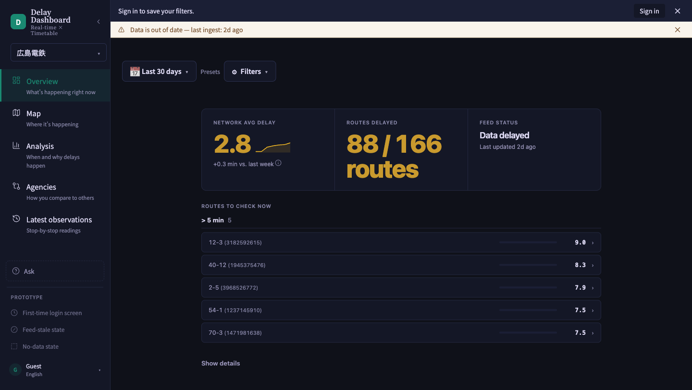

- “Average delay · …”: the average delay in minutes, drawn over a small line of the daily values. A sentence beside it compares the period with the same number of days just before it; the ⓘ icon explains the comparison.
- “… of … routes”: how many routes averaged a set number of minutes late or more.
- The feed’s status: “Reporting live”, “Feed quiet for …” or “No reports yet”, with the time of the last report.
- **Routes to check now**: the most delayed routes, grouped by how late they ran on average. Click a route to open its page (section 5-6). “No routes need attention” means none qualifies.
- **Delay concentration**, **Worst hour of day** and **By service day**: whether delay sits with a few routes, which hour runs latest, and how weekdays compare with weekends and holidays. Click a card for a larger view. In **Worst hour of day**, click an hour to list the routes that ran late then.

If the period has no observations, the screen says so and suggests a change to the conditions.

---

## 5. Routes — which routes run late

### 5-1. The report screens

**Routes**, **Time**, **Why** and **Compare** (periods and routes) share one layout, as do the council report and the delay certificate in **Reports**.

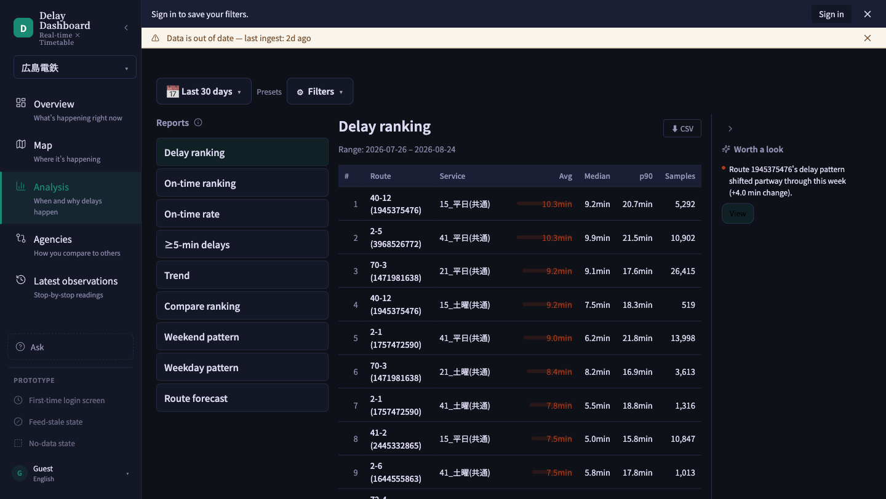

| Area | Where | What it holds |
|---|---|---|
| Scope sentence | Top | The conditions the report counts (section 3) |
| Report list | Left | This screen’s reports in groups such as “Rankings” and “Punctuality”, each with a one-line description |
| Report | Center | The chosen report: a table or charts, the period it covers (“Range: …”), and **Download CSV** where the report has rows to export |

A screen opens with its first report already showing; click another in the list to switch. On a phone, the list becomes a drop-down above the report.

If a report takes a while to count, after a few seconds it says “Still working on it…”. For a period longer than a week it says “Still working: a long period takes longer to count.” and offers **Narrow to the last 7 days of the period**.

### 5-2. Not sure how to read a report? Use the ⓘ icon

Click the small ⓘ next to the “Reports” heading above the list. A popup, “How to read these reports”, explains what each kind of report is for.

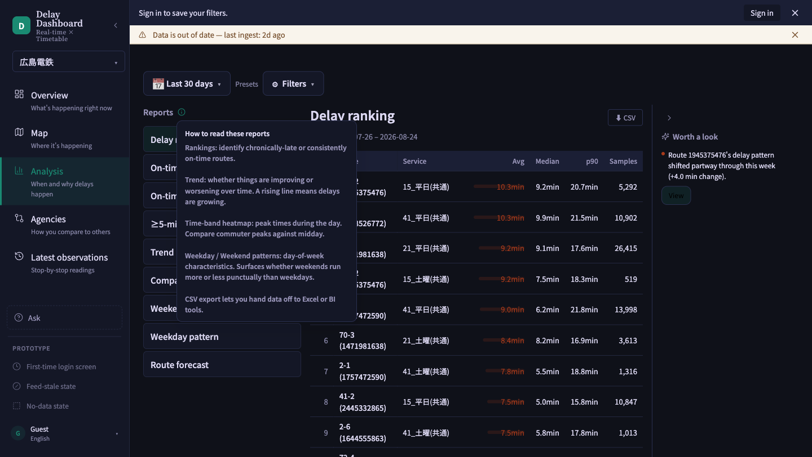

- Rankings find the routes that are chronically late or consistently on time.
- The trend shows whether things are improving or worsening; a rising line means delays are growing.
- The time-band heatmap shows the peak times of the day, such as commuter peaks against midday.
- Routes on weekdays and on weekends and holidays give each route’s average delay for that group of days; compare the two to see which routes run later on weekends.
- CSV export hands the data to Excel or other tools.

Click anywhere else, or press Escape, to close it.

### 5-3. The reports on Routes

| Report | What it shows |
|---|---|
| **Delay ranking** | Which routes run latest, worst first |
| **Lowest average delay** | Routes with the lowest average delay, best first |
| **On-time rate** | Share of departures inside the on-time threshold, by route |
| **≥5-min delays** | Routes with the most departures five minutes or more late |

If you are not sure where to start, open **Delay ranking** to see which routes are worst, then the **Trend** on **Time** to see when.

### 5-4. Reading Delay ranking

The columns:

- **Route**: click a name to open that route’s page (5-6).
- **Service**: the timetable the trip ran on (weekday, weekend and holiday, or a special day).
- **Avg (min)**: the average delay.
- **Median (min)**: the middle value, a typical delay that a few extreme days cannot pull up.
- **p90 (min)**: 90% of departures were no later than this; it shows how bad a bad day gets.
- **Samples**: the number of observations behind the row. Fewer samples mean less certainty.

**Delay ranking** and **Lowest average delay** leave out routes observed fewer than 100 times in the period, so a rarely run special-day variant cannot top them on a handful of trips. Tick “Include routes observed fewer than 100 times” to rank those routes too; their samples carry a “few data” badge. When more routes qualify than the table shows, the line under it says how many are shown (“Showing … of …”), and **Show all** lists the rest.

**Download CSV** at the top right of the report downloads the table.

### 5-5. On-time rate and ≥5-min delays

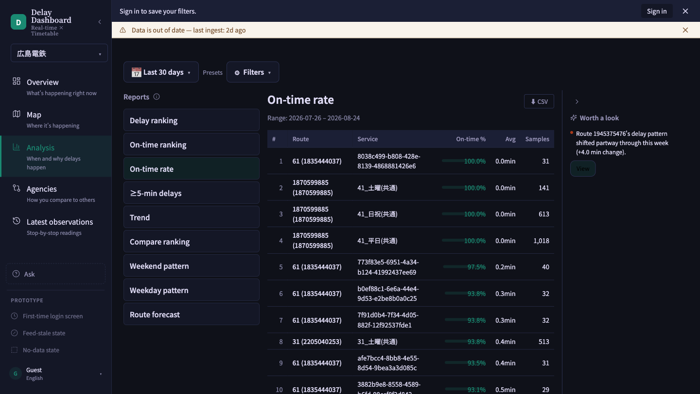

**On-time rate** lists routes with their “On-time %”: the share of departures that left within the on-time tolerance in the scope sentence. Closer to 100% is better. A “few data” mark in the **Data** column means there were too few departures to trust the percentage. Under the table, “Headway quality” covers the routes scheduled every 12 minutes or more often, and “Minimum performance standard” appears when the agency has set targets for its routes.

**≥5-min delays** counts, route by route, the departures that left five minutes or more late (“≥5 min late”).

### 5-6. A route’s own page

Clicking a route’s name — in a report, in **Routes to check now** on Pulse, or in the Live trip list — opens that route’s page.

- At the top, “Routes / (route name)” leads back to the list, and the page states its question: “Where does delay build up?”.
- The filters under it — “Route”, “Service pattern”, “From”, “To”, “Days” and “Time” — take effect when you press **Apply**. Until then the page says “Changes not applied yet”.
- **Delay by stop** shows the mean departure delay at each stop. Tick “Compare with one week earlier” to add the same weekdays one week before.
- Four tabs: “Along the route” (the delay stop by stop), “Trips over time” (each trip on the most recent day the route ran), “Map” and “Stop table”. Pick a stop under “Selected stop” to see its figures.
- **Download CSV** downloads the stop figures. **Save analysis** keeps these conditions in this browser, to reopen from **Reports → Saved analyses** (section 10-2).

The figures are means along the route’s representative path. They show where delay builds up; they do not by themselves establish its cause.

---

## 6. Time — when delay happens

Time holds **Trend**, **Routes on weekdays**, **Routes on weekends and holidays** and **Route forecast**.

### 6-1. Trend

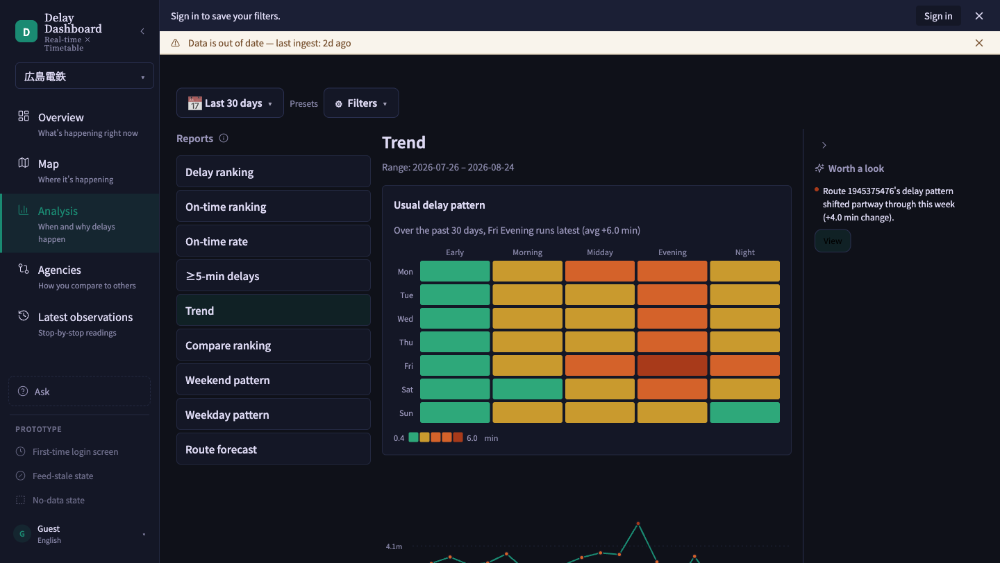

- **Usual delay pattern**: a grid of the days of the week against time bands. Darker cells mean more delay, and the sentence above the grid names the day and time band that ran latest over the period.
- The daily chart: the average delay day by day, with a dashed 7-day average and a “Schedule change” mark where a new timetable took effect. A rising line means delays are growing. Drag across the chart to narrow the period (“Drag across the chart to narrow the period”); “Reset period” undoes it.
- **Time-band heatmap**: hours 0–23 down the side, dates along the bottom. Darker means more delay, and an outline marks the most severe cells. Click a cell to narrow the screen to that day and time band.

A trend needs more than one day. For a one-day period, only the heatmap is shown, with a suggestion to pick a longer period.

### 6-2. Routes on weekdays, and on weekends and holidays

Each route’s average delay on that group of days (“Avg (min)”, with “Samples”). Compare the two to see which routes run later on weekends. These reports choose their own days, so a days or timetable condition in the scope sentence shows as not used.

### 6-3. Route forecast

When routes tend to run late, by day of week and time of day. “Day × time of day (all routes)” shows the agency as a whole, and “Routes that run late” lists the routes. Click one, or pick it from the “Route” list, for that route’s breakdown.

---

## 7. Why — what the data can explain

**Dwell/running time** splits each route’s delay into the time spent waiting at stops (“Dwell avg”, “Dwell p50”, “Dwell p90”) and the time spent running between them (“Running avg”, “Running p50”, “Running p90”), in seconds, with the number of observations behind each.

- Splitting delay needs arrival times. When an agency’s feed reports departures only, the report says “Splitting delay needs arrival times” and offers **See when delay happens** (the Time screen) and **Compare weekdays and weekends** (the comparison in section 8-1).
- The split cannot be narrowed to one time band. With a time band chosen, the report says so; choose “All hours” in the scope sentence to see it.
- Under the report, “Rain vs. dry average delay” compares days with and without rain where a weather station is set up for the agency, and “Headway quality” covers the high-frequency routes.

---

## 8. Compare — side by side

Two buttons at the top switch between **Periods and routes** and **Agencies**.

### 8-1. Periods and routes

**Compare ranking** puts each route’s average delay on weekdays and on weekends and holidays side by side (“Weekday (min)”, “Weekend/Holiday (min)”), with the gap (“Diff (min)”) and which side is higher (“Direction”: “Weekend > Weekday” or “Weekday > Weekend”). Routes with the largest gap come first.

### 8-2. Agencies

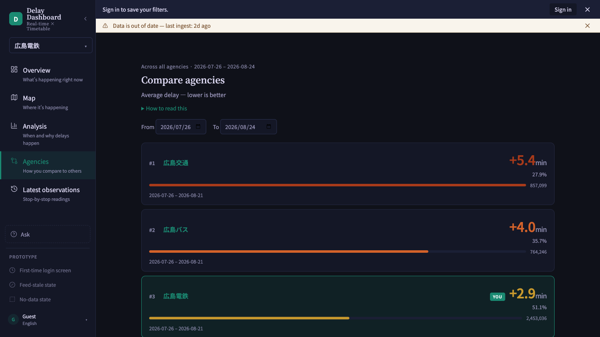

“Compare agencies” lists every agency for the dates in “From” and “To”, latest-running first (“Average delay — lower is better”). Your own agency carries a “YOU” badge.

Each row shows “Avg delay (min)” on a shared axis, “On-time %”, “Service delivered %”, “Vehicle-km delivered %”, “Samples” and the dates the agency has data for. A “Behind” badge means that agency’s totals have not caught up with its latest data yet. “How to read this” explains each figure. Where ridership weights have been set up, “Weight by ridership” switches the on-time figure to a ridership-weighted one.

Click an agency’s name to open that agency’s **Live** screen.

---

## 9. Live — the trips running now

Live shows the trips reporting now, under the heading “Current observations”. It refreshes itself every 30 seconds, and **Refresh now** fetches at once. Beside it, “Last updated …” says how recent the last report is, or “Feed quiet for …” when reports have stopped.

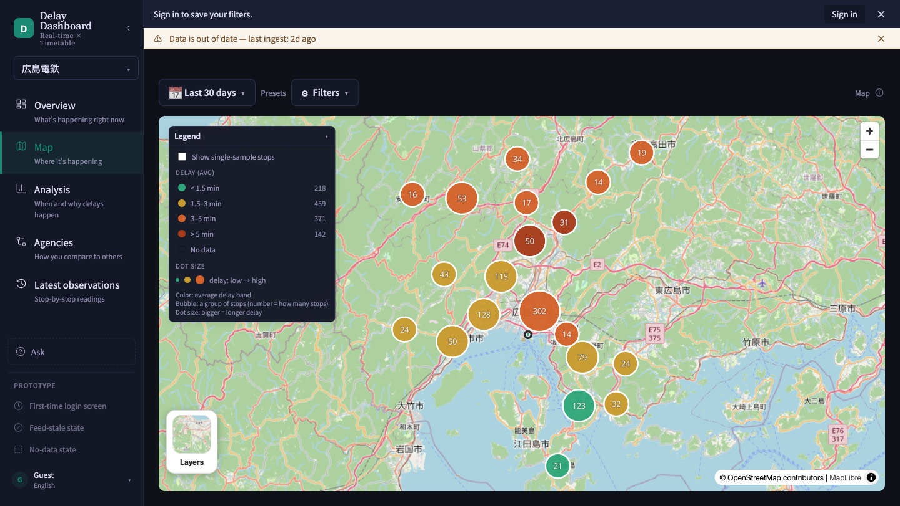

- The map places each trip at its last reported stop, not at a GPS position. The legend explains the marks: “Latest report”, “Report trail”, “Delayed” and “Number = overlapping trips”. Hover over a trip for its details; “Pin this trip” keeps them on screen. “Fit all trips in view” moves the map to frame every trip, and **Layers** switches the map style.
- Filters on the map: choose a “Route” and a “Service pattern”, then press **Apply**.
- **Play the day** replays the day’s observations on the map; “Back to current observations” returns to now.
- **Trips to check**, on the right: “Observed”, “Delayed 5+ min” and “On-time rate” for the trips reporting now, **Download CSV** for those trips, and a list of the trips running five minutes or more late, latest first. Each trip in the list links to its route’s page. “View observed trips” lets you pick a running route, a direction and a trip, and follow how its delay has developed.

When no vehicle is reporting, the map says “No vehicles are reporting right now”. That is normal late at night; if it lasts through service hours, the agency’s feed may be down.

The first time you open Live, a three-step tour points out the filters, the trip list and the search field. “Later” closes it for now; “Got it” finishes it.

---

## 10. Reports — documents to hand on

Three tabs along the top: **Period summary**, **Saved analyses** and **Council report & delay certificate**.

### 10-1. Period summary

How service ran over the period, on one printable page: the scope sentence, then “Mean delay over time” (a chart) and “Mean delay by service pattern” (a table, where “Open analysis →” opens that route’s page). Each part has its own **Download CSV**. The **Export** menu at the top right offers “Download PNG”, “Download CSV”, “Create share link” and “Print / Save PDF”. At the bottom, “View filters and definitions” links to the detailed reports.

Missing observations are not counted as on time; only the periods with observations are shown.

### 10-2. Saved analyses

The analyses you saved with **Save analysis** on a route’s page. Click one to reopen it with the latest data; **Delete** removes it. They are kept in this browser only, so another browser or device will not show them.

### 10-3. Council report & delay certificate

The list on the left holds **Council report** and **Delay certificate**.

**Council report** is a period summary written for a council or board: four headline figures (“On time”, “Average delay”, “Departures observed”, “Planned trips”), a written summary with its notes, and **Print / Save as PDF**.

**Delay certificate** gives a passenger proof of a late departure:

1. Choose the “Date” and the “Route” they travelled on (“Search routes”).
2. Under “Scheduled departure”, pick their departure (“Choose a departure”). Each one shows how late it left.
3. The certificate appears with a statement and the “Operator”, “Route”, “Date”, “Scheduled departure”, “Actual departure” and “Delay”. Times are at the first stop recorded for that trip in the operator’s real-time feed. Press **Print / Save as PDF**.

The list holds only departures that left late. A departure missing from it left on time or early, or was not in the live feed. If no departure of the route left late that day, the page says so.

For staff, “All late departures in the period” opens the full list under the scope sentence’s conditions, with **Download CSV**.

---

## 11. Ask — questions with ready answers

Ask answers common questions about delay with a table or chart, so you do not have to find the right report first. Open it with **Ask** in the sidebar, below the screens.

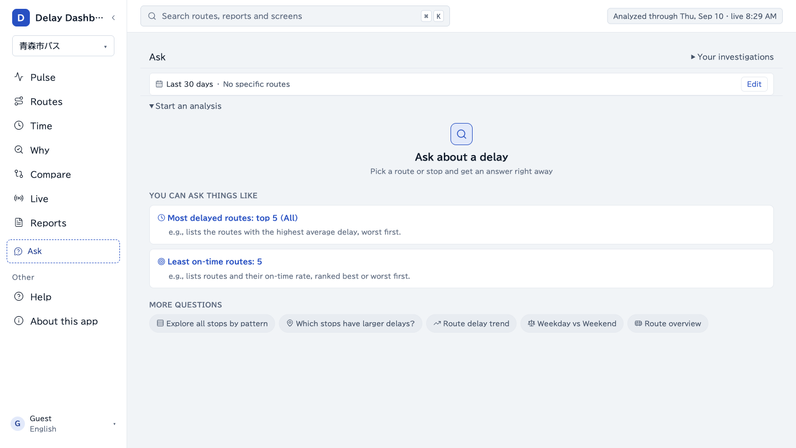

### 11-1. Asking a question

- The bar at the top shows the period and routes your questions will cover. **Edit** changes them (“Date range”, “DOW”, “Time band”, “Routes”); press **Apply** to keep the change.
- Under “You can ask things like”, a card runs at once: “Most delayed routes: top 5 (All)” or “Least on-time routes: 5”.
- Under “More questions”, each question needs a route first: “Explore all stops by pattern”, “Which stops have larger delays?”, “Route delay trend”, “Weekday vs Weekend” and “Route overview”. Pick the route, adjust any other setting, and press **Run**.
- After the first answer, open **Start another analysis** at the bottom to see every question. Choosing one opens its settings, such as “Top” and “Service” for the most-delayed-routes question.

### 11-2. Reading the answer

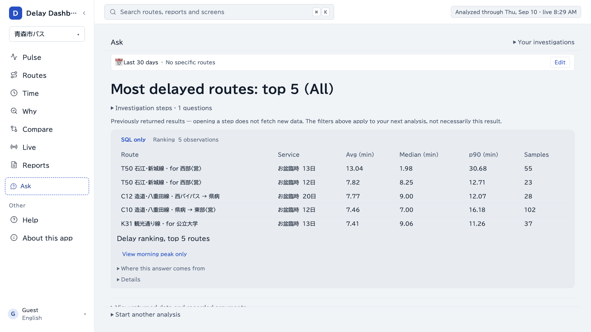

- The question heads the answer, with the table or chart under it.
- “Where this answer comes from” names the route, the conditions and how the figures were made. A “SQL only” badge means they were computed directly from the data; “LLM” marks a summary written by a language model from a result already fetched.
- Buttons under the answer suggest next steps, such as “View morning peak only”, “View on the map”, “Compare with two weeks ago” and “Save as PNG”.
- “Download result (JSON)”, and a CSV for each table, save the answer.
- Each question becomes a step of the investigation. “Investigation steps” lists them so you can look back; “Return to latest” brings you back to the newest.

### 11-3. Asking about the result in your own words

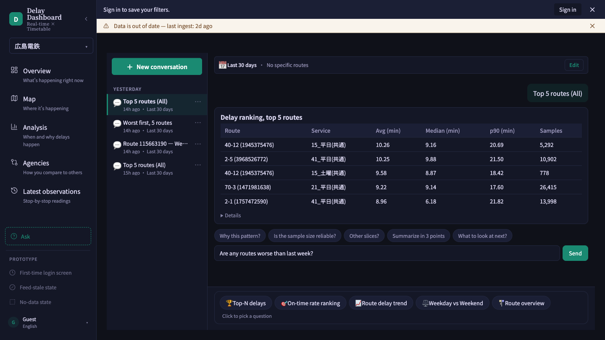

Where it is available to your account, a box under the latest answer, “Ask about this result...”, takes a question in your own words. Press the send button (the paper-plane icon) for an answer grounded in the result on screen. As the note under the box says, the AI runs only when you send, and it answers from the stored result without fetching new data. For a stop-by-stop answer, select a stop first.

The box is for digging into the result already on screen; to start a new ranking, use a question card instead. If an answer cannot be produced, a message says why — the question is too long, traffic is high, or the connection dropped — so shorten the question, wait a moment, or try again.

When the box is not shown, free-text questions are not available to your account. The question cards still work, because they are computed directly from the data.

### 11-4. Your investigations

“Your investigations” at the top lists your earlier investigations by date. Search them, or start afresh with “New investigation”; each investigation’s menu renames, pins or deletes it. Without signing in, investigations are kept only in the browser where you asked them.

If you are not sure which report to open, picking a question on Ask is often the quickest way in.
