# 遅延ダッシュボード 利用マニュアル

このマニュアルは、遅延ダッシュボード（Delay Dashboard）を初めて使う方向けの操作ガイドです。
特に「分析（Analysis）」タブは機能が多く分かりにくいという声が多いため、
そこは特に丁寧に、手順を追って説明しています。

対象データ: 広島電鉄（agency 8）の実データを例に画面キャプチャしています。
他の事業者（青森市バス／広島バス／広島交通）でも操作方法は同じです。

---

## 目次

1. [事業者を選ぶ（トップ画面）](#1-事業者を選ぶトップ画面)
2. [画面共通の使い方（フィルターバー）](#2-画面共通の使い方フィルターバー)
3. [Overview（概況）タブ — 「いま何が起きているか」](#3-overview概況タブ--いま何が起きているか)
4. [Map（地図）タブ — 「どこで起きているか」](#4-map地図タブ--どこで起きているか)
5. [Analysis（分析）タブ — 「いつ・なぜ遅延が起きるか」【最重要】](#5-analysis分析タブ--いつなぜ遅延が起きるか最重要)
6. [Agencies（比較）タブ — 「他社と比べてどうか」](#6-agencies比較タブ--他社と比べてどうか)
7. [Latest observations（最新データ）タブ — 「今この瞬間のバス」](#7-latest-observations最新データタブ--今この瞬間のバス)
8. [Ask（質問）タブ — 会話形式で聞く](#8-ask質問タブ--会話形式で聞く)
9. [その他（PROTOTYPE欄について）](#9-その他prototype欄について)

---

## 1. 事業者を選ぶ（トップ画面）

アプリを開くと、まず事業者（バス会社・鉄道会社）を選ぶ画面が表示されます。

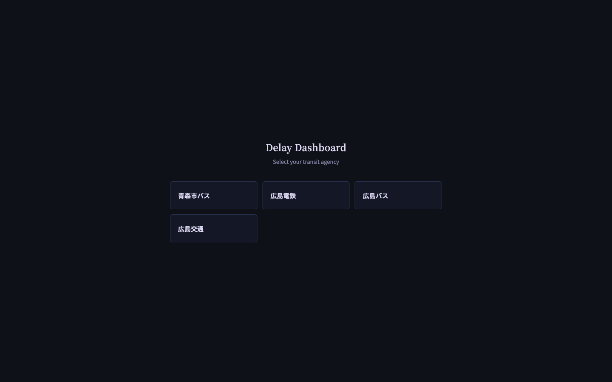

見たい事業者のカードをクリックすると、その事業者専用のダッシュボードに入ります。
一度事業者を選ぶと、次回からは前回見ていた画面が自動的に開きます
（別の事業者に切り替えたいときは、左上のロゴをクリックするか、
サイドバー上部の事業者名のプルダウン▾から選び直せます）。

---

## 2. 画面共通の使い方（フィルターバー）

Ask タブ以外のほぼ全ての画面の上部に、次の「絞り込みバー」があります。

- **期間**（例：「Last 30 days」＝過去30日間）
- **曜日 / 時間帯 / 運行系統（サービスタイプ）などの詳細フィルター**（「Filters ▾」）

ここで期間や条件を変えると、そのページに表示される数字・グラフ・表が
すべてその条件に絞り込まれます。**タブを移動しても設定は保持されます**（URLにも条件が残ります）。

「とりあえず全体を見たい」ときは期間を「Last 30 days」のままにしておけば問題ありません。
特定の路線や特定の時間帯だけを深掘りしたいときに、この絞り込みバーを使ってください。

> 補足：画面上部に「データが最新でない（Data is out of date）」という黄色い注意バーが出ることがあります。
> これは取り込み（データ収集）が少し遅れているだけで、アプリの故障ではありません。閉じるボタン（×）で消せます。

---

## 3. Overview（概況）タブ — 「いま何が起きているか」

ログイン後、最初に表示されるのがこのタブです。**「今日、全体としてどれくらい遅れているか」を一目で確認する場所**です。

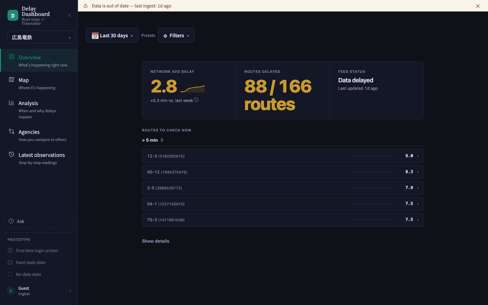

主な見どころ：

- **NETWORK AVG DELAY**（ネットワーク全体の平均遅延）：選んだ期間の平均遅延分数。先週との差も表示されます。
- **ROUTES DELAYED**（遅延している路線数）：全路線のうち、実際に遅れが出ている路線の割合。
- **FEED STATUS**（データ受信状況）：データがちゃんと最新まで届いているかどうか。
- **ROUTES TO CHECK NOW**（今すぐ確認すべき路線）：特に遅延がひどい路線（5分以上など）が一覧で並びます。
  路線名をクリックすると、その路線の詳しい状況を見に行けます。

「まず全体感をつかみたい」ときは、このタブだけ見れば十分です。

---

## 4. Map（地図）タブ — 「どこで起きているか」

地図上に、バス停・駅ごとの平均遅延が色付きの丸（バブル）で表示されます。

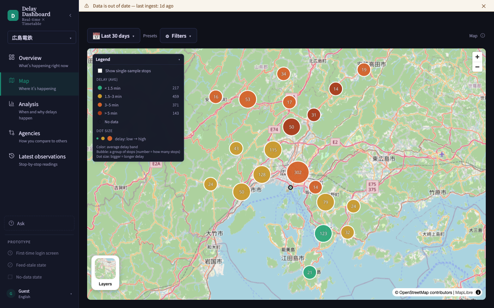

- **色**：遅延の大きさを表します（緑＝ほぼ遅延なし　→　オレンジ・赤＝遅延が大きい）。
- **丸の大きさ**：遅延の程度が大きいほど丸が大きくなります。
- **丸の中の数字**：その場所にまとめられている観測ポイント（バス停）の数です。
- 左上の「Legend（凡例）」パネルで、色の基準や記号の意味を確認できます。
- 「Show single-sample stops」にチェックを入れると、データ数が少ない（＝信頼度が低い）バス停も表示されます。

「どのエリアで遅延が集中しているか」を地理的に把握したいときに使います。

---

## 5. Analysis（分析）タブ — 「いつ・なぜ遅延が起きるか」【最重要】

このタブが最も機能が多く、分かりにくいと感じやすい部分です。以下、順番に説明します。

### 5-1. 画面の構成

Analysis タブを開くと、まだ何も選ばれていない状態ではこのような画面になります。

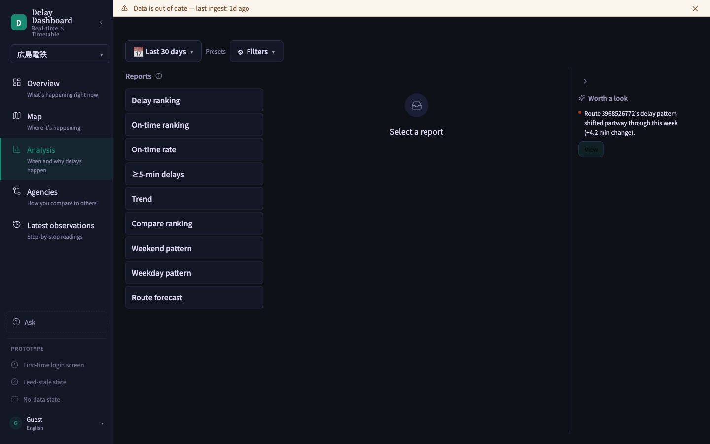

画面は大きく3つのエリアに分かれています。

| エリア | 場所 | 役割 |
|---|---|---|
| ① レポート一覧 | 画面左側 | 見たい「切り口（レポートの種類）」をここから選ぶ |
| ② メインエリア | 画面中央 | 選んだレポートのグラフ・表がここに表示される |
| ③ 「Worth a look（注目ポイント）」パネル | 画面右側 | アプリが自動的に見つけた「気になる変化」のお知らせ |

**つまり、このタブは「①左のメニューから見たいレポートを1つクリックする」→「②中央にグラフや表が出る」という使い方です。**
最初は中央に「Select a report（レポートを選んでください）」としか出ませんが、これは壊れているのではなく、
まだ何も選んでいないだけです。

### 5-2. レポートの種類（① 左メニュー）

左メニューには次のレポートが並んでいます。それぞれ「何が知りたいときに使うか」を対応させると：

- **Delay ranking（遅延ランキング）**：どの路線が一番遅れているか、順位で見たいとき
- **On-time ranking（定時運行ランキング）**：逆に、どの路線が時間通りに来ているか見たいとき
- **On-time rate（定時運行率）**：路線ごとに「時間通りに来た割合（％）」を見たいとき
- **≥5-min delays（5分以上の遅延）**：特に大きな遅延（5分以上）だけを見たいとき
- **Trend（推移）**：遅延が日々どう変化しているか、曜日・時間帯でどう違うかを見たいとき
- **Compare ranking（比較ランキング）**：路線同士を横並びで比較したいとき
- **Weekend pattern / Weekday pattern（土日パターン／平日パターン）**：平日と土日で傾向が違うか見たいとき
- **Route forecast（路線予測）**：この先の遅延傾向を予測して見たいとき

迷ったら、まず **Delay ranking**（どの路線が悪いか）→ **Trend**（いつ悪いか）の順に見るのがおすすめです。

### 5-3. 困ったら「？」ヒントアイコンを押す

「Reports」の文字の右にある小さな丸い「ⓘ（ヒント）」アイコンをクリックすると、
**各レポートの読み方を説明したポップアップ**が表示されます。
これはアプリに最初から用意されている「使い方ガイド」なので、迷ったときはまずここを確認してください。

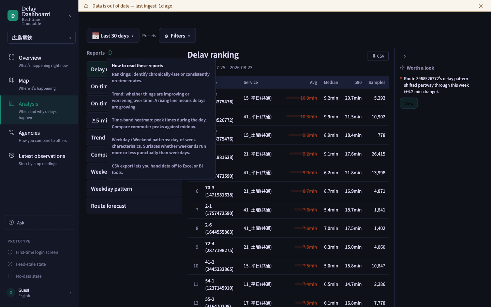

このポップアップでは、

- ランキング表は「常に遅れがちな路線／常に時間通りの路線」を見つけるためのもの
- Trend（推移）は「良くなっているか悪くなっているか」を見るためのもの、右肩上がりなら悪化中
- 時間帯ヒートマップは「1日の中でいつが混みやすいか」を比較するためのもの
- 平日・土日パターンは「曜日によるクセ」を見つけるためのもの
- CSVエクスポートは、表のデータをExcelなどに書き出す機能

…といった説明が読めます。**各レポート画面の見出し付近にも、同じような「？」アイコンがある場合があります。**
グラフの意味が分からなくなったら、まずこのアイコンを探してみてください。

### 5-4. 実際にレポートを見てみる：Delay ranking（遅延ランキング）

左メニューの「Delay ranking」をクリックすると、路線ごとの遅延が大きい順に一覧表示されます。

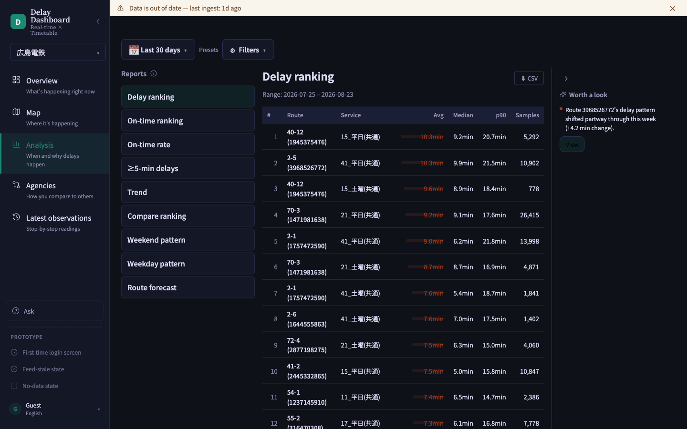

表の列の意味：

- **Avg**：平均遅延（分）
- **Median**：中央値（極端に遅れた日に引っ張られにくい「typicalな遅延」）
- **p90**：上位10%の悪いケースでの遅延（＝「運が悪いとこれくらい遅れる」の目安）
- **Samples**：その集計に使われた観測データの件数（数が少ないと信頼度は下がります）

右上の「⬇ CSV」ボタンから、この表をそのままダウンロードできます。

### 5-5. Trend（推移）レポート — いつ遅れるかを見る

左メニューの「Trend」をクリックすると、以下のような画面になります。

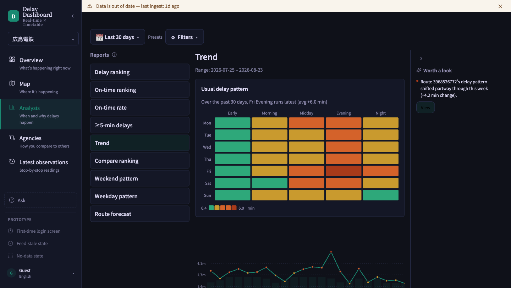

- 上の色付き表（曜日 × 時間帯）は「**いつ遅延が起きやすいか**」を色の濃さで表したヒートマップです。
  色が濃い（赤に近い）ほど遅延が大きいことを意味します。
  例のキャプチャでは「金曜の夕方（Fri Evening）が最も遅れる」ことが一目で分かります。
- 下の折れ線グラフは、日ごとの平均遅延の推移です。右肩上がりなら悪化傾向、右肩下がりなら改善傾向です。

### 5-6. On-time rate（定時運行率）レポート

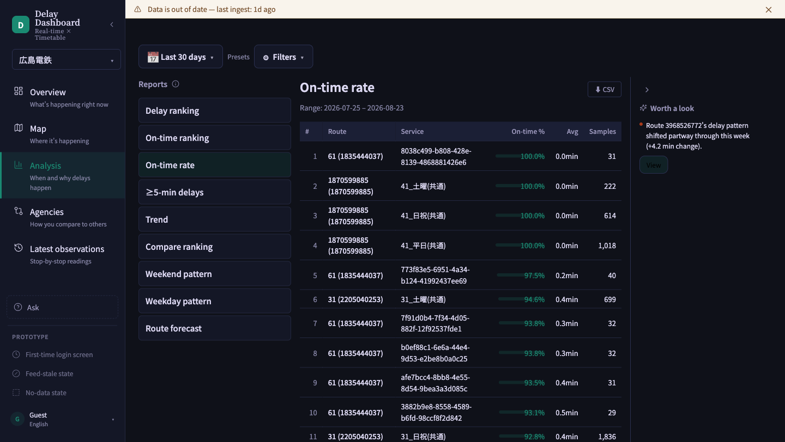

路線ごとに「時間通りに来た割合（％）」がランキング形式で並びます。100%に近いほど良好です。

### 5-7. 右側の「Worth a look（注目ポイント）」パネル

Analysis タブの右側には、常に小さなパネルが表示されています。これは比較的新しく追加された機能で、
**アプリが自動的にデータの変化を見つけて教えてくれる「お知らせ」欄**です。手動で探さなくても、
気になる変化があれば、ここに自動的に表示されます。

例：「Route 3968526772's delay pattern shifted partway through this week（この路線の遅延パターンが今週の途中で変化しました）」
のように、注目すべき路線と変化の大きさ（例：+4.2分）が表示されます。

パネル内の「View」ボタンを押すと、その路線・その期間にフォーカスした Trend 画面へ自動的に移動します。

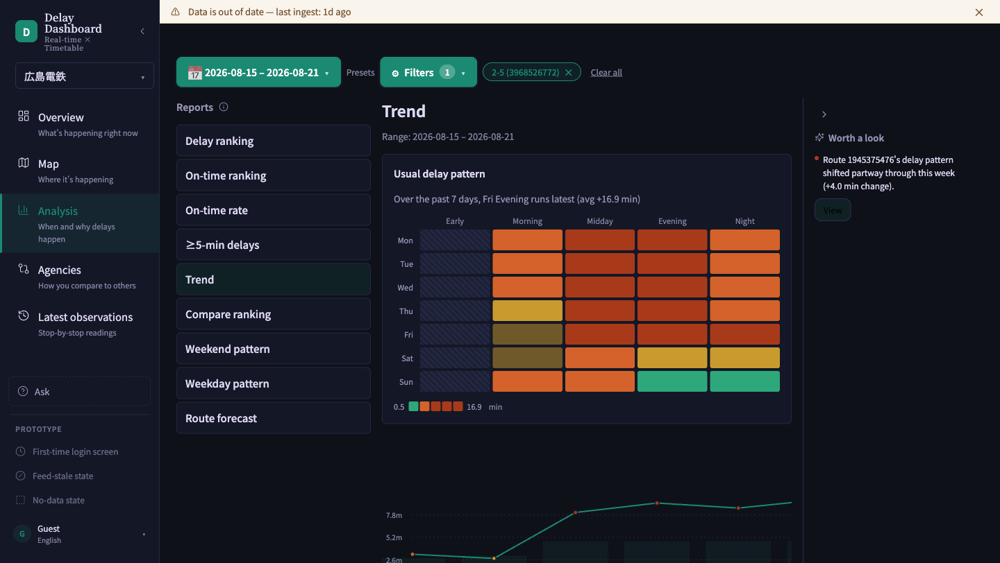

このとき、画面上部のフィルターバーに期間と路線名のチップ（タグ）が自動的にセットされていることが分かります。
これは「⑤-1で説明したフィルターバー」が Analysis タブでも使われている例です。
元の状態に戻したいときは、フィルターバー内の「Clear all」をクリックしてください。

パネル左上の矢印（▶）でパネルを折りたたむこともできます。**必ずしも通知があるとは限らず**、
特筆すべき変化がないときは空欄になることもあります。

### 5-8. Analysis タブの使い方まとめ

1. 左メニューから見たいレポート（切り口）を1つクリックする
2. 分からない用語が出てきたら「ⓘ」ヒントアイコンを押して説明を読む
3. 右側の「Worth a look」パネルに通知があれば、まずそこから見てみる（アプリが重要な変化を教えてくれている）
4. 特定の路線・期間だけ見たいときは、上部のフィルターバーで絞り込む

---

## 6. Agencies（比較）タブ — 「他社と比べてどうか」

サイドバーには「Agencies（How you compare to others）」と表示されていますが、
これはネットワーク全体、つまり **他の事業者と自社を比較する画面** です。

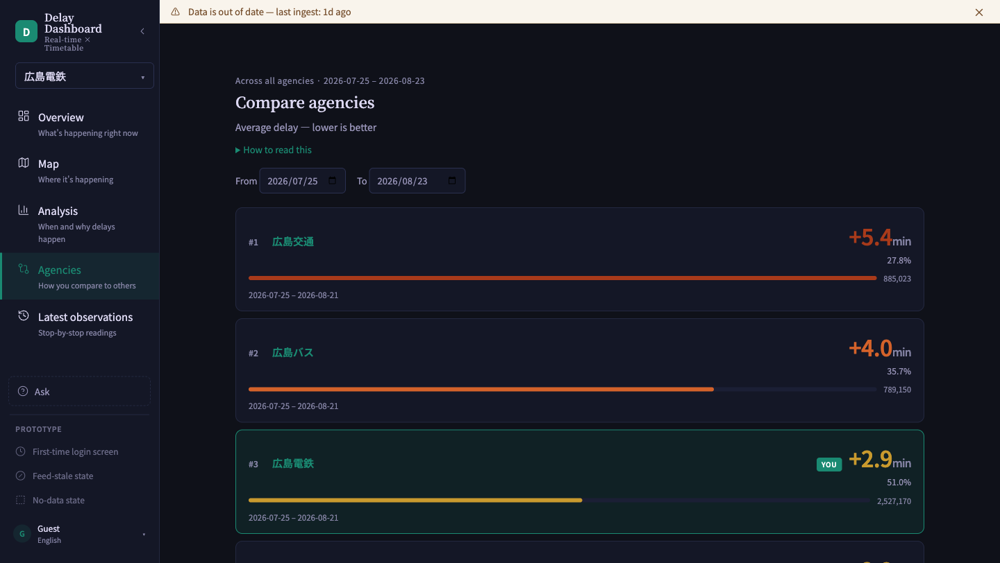

各事業者が平均遅延の小さい順にランキング表示され、自社には「YOU」のバッジが付きます。
「自分たちは他社と比べて良いのか悪いのか」を確認したいときに使います。

---

## 7. Latest observations（最新データ）タブ — 「今この瞬間のバス」

サイドバーの表示名は「Latest observations」ですが、内容は **直近の運行状況をリアルタイムに近い形で見る画面** です。

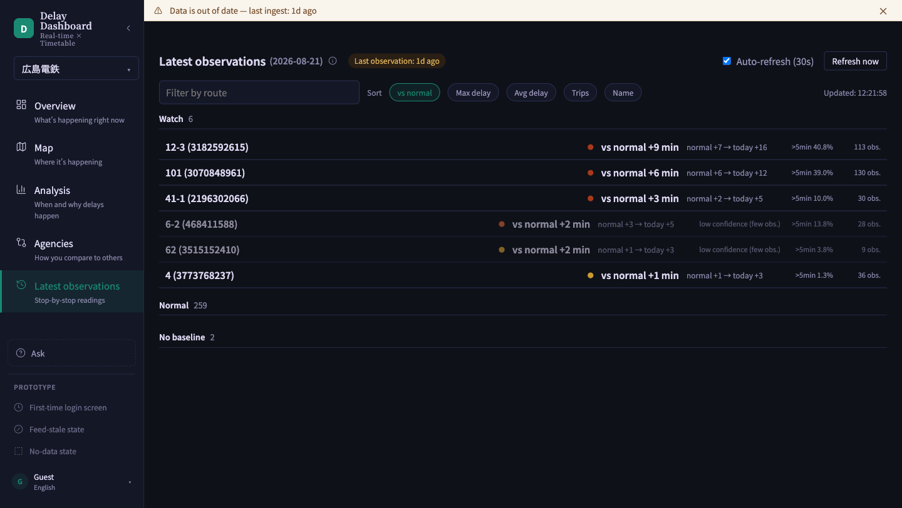

- **Watch（要注意）**：普段（normal）と比べて今日の遅延が大きく増えている路線が一覧に出ます。
  「vs normal +9 min」は「いつもより9分多く遅れている」という意味です。
- **Normal**：普段通りの路線数
- **No baseline**：まだ「普段の遅延」の基準データが十分でない路線数

右上の「Auto-refresh（自動更新）」にチェックが入っていれば、30秒ごとに自動更新されます。
「今まさに何かが起きていないか」を確認したいときに使う画面です。

---

## 8. Ask（質問）タブ — 会話形式で聞く

Ask タブは、他のタブのように自分でグラフを探し回るのではなく、
**知りたいことをチャット形式で選んで、その場で答え（表やグラフ）をもらう**ためのタブです。

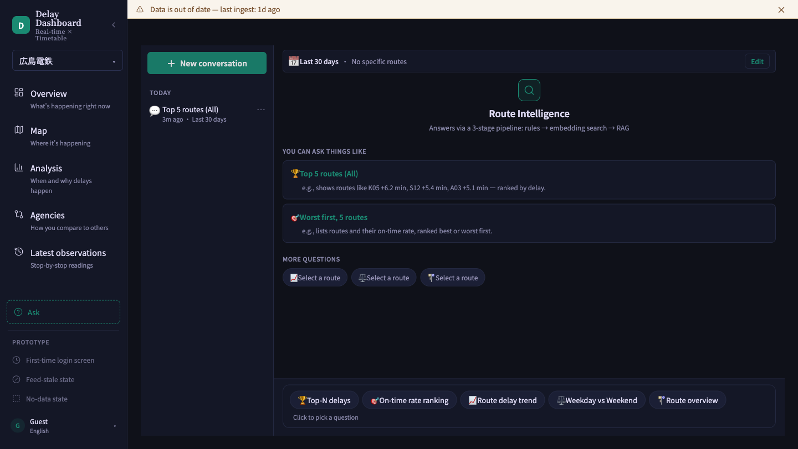

使い方：

1. 画面中央、または一番下の「質問ピッカー（Question picker）」から、聞きたい種類の質問を選びます
   （例：🏆 Top-N delays＝遅延トップN、🎯 On-time rate ranking＝定時運行率ランキング、
   📈 Route delay trend＝路線の遅延推移　など）。
2. 必要に応じて「Top: 5」「Service: All」のような条件を選び、「Run」を押します。

質問すると、画面にはこのように結果が表示されます。

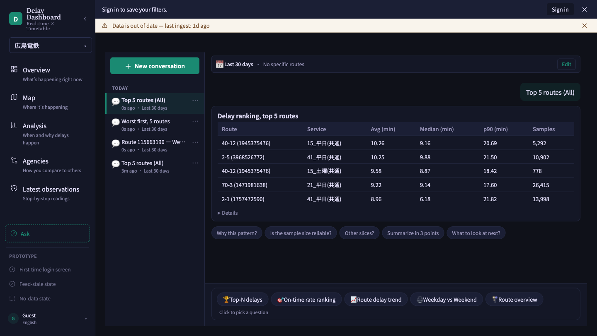

- 右側の吹き出しに、選んだ質問が表示されます（例：「Top 5 routes (All)」）。
- その下に、答えとなる表（ここでは遅延ランキング上位5路線）が表示されます。
- 表の下には「**Why this pattern?（なぜこうなった？）**」「**Is the sample size reliable?（データ数は十分？）**」
  などの**フォローアップ質問（追加で聞ける質問）**がボタンとして並びます。クリックすると会話を続けられます。
- **その下には自由入力欄もあります。** 用意されたボタンにない質問（例：「先週と比べて悪化した路線はある？」）を
  そのまま文章で打ち込み、「Send」を押すと、今表示されている結果に基づいた回答が返ってきます。

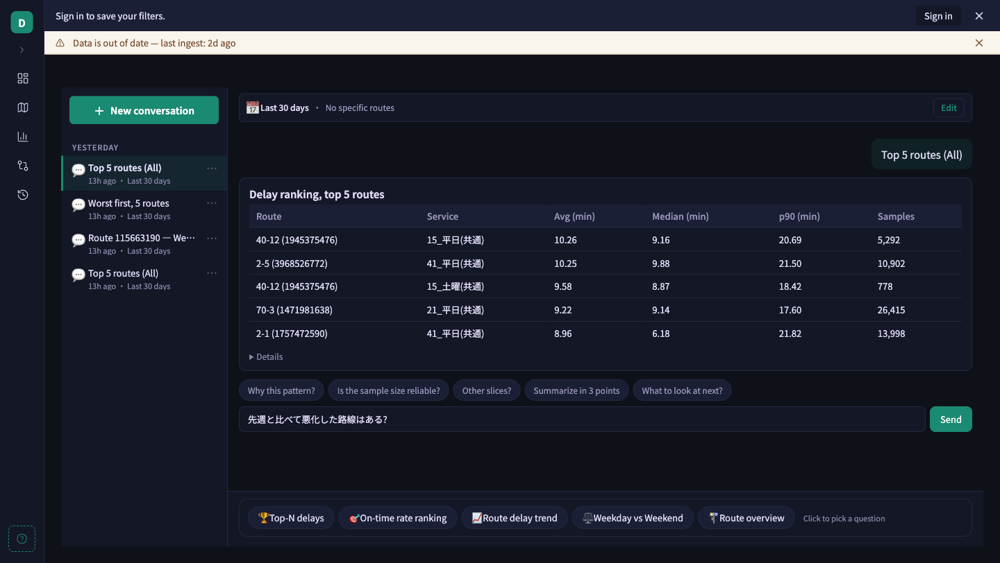

> 補足：この自由入力は、あくまで**今画面に表示されている結果を深掘りするための質問**に使うものです
> （新しいランキングを最初から作り直したいときは、下のクイック質問ショートカットや質問ピッカーを使ってください）。
> 回答できなかった場合は、原因に応じたメッセージ（質問が長すぎる／アクセスが集中している／通信エラー、など）が
> 表示されるので、それに従って短くする・少し待つ・もう一度試すなどしてください。

- さらに下には、新しい質問を始めるための**クイック質問ショートカット**（🏆🎯📈⚖️🚏のアイコン付きボタン）が並びます。
- 左側のサイドバーには、これまでに聞いた質問の履歴が会話単位で保存されます。「＋ New conversation」で新しい会話を始められます。

「レポートのどれを見ればいいか分からない」というときは、Analysis タブで悩むより、
まず Ask タブで聞きたいことをそのまま選んでみるのが早い場合があります。

---

## 9. その他（PROTOTYPE欄について）

サイドバー最下部に「PROTOTYPE」という見出しで、
「First-time login screen」「Feed-stale state」「No-data state」といったリンクがあります。
これらは開発者がエッジケース（特殊な画面状態）を確認するための**社内・開発用のプレビュー**であり、
通常の業務利用では使いません。誤ってクリックしても壊れるものではありませんが、
基本的には無視して問題ありません。

---

以上が一通りの操作ガイドです。特に **Analysis タブは「① 左メニューでレポートを選ぶ → ② ⓘヒントで読み方を確認する →
③ 右側の注目ポイント通知を確認する」** という3ステップを覚えておけば迷いにくくなります。
