# 遅延ダッシュボード 利用マニュアル

このマニュアルは、遅延ダッシュボードを初めて使う方向けに、画面ごとの使い方を順に説明します。

画面写真には、青森市バスの2026年8月12日〜9月10日の実データを、9月11日の朝に見た状態で使っています。どの事業者でも画面の使い方は同じです。事業者のフィードが送っていないデータが必要なレポートでは、画面にその旨が表示されます。

---

## 目次

1. [事業者を選ぶ](#1-事業者を選ぶ)
2. [画面の移動](#2-画面の移動)
3. [表示の条件：画面上部の一文](#3-表示の条件画面上部の一文)
4. [概況 — 運行のいまを見る](#4-概況--運行のいまを見る)
5. [路線 — どの路線が遅れているか](#5-路線--どの路線が遅れているか)
6. [時間 — いつ遅れるか](#6-時間--いつ遅れるか)
7. [要因 — データで説明できること](#7-要因--データで説明できること)
8. [比較 — 並べて比べる](#8-比較--並べて比べる)
9. [ライブ — いま走っている便](#9-ライブ--いま走っている便)
10. [レポート — 人に渡す資料](#10-レポート--人に渡す資料)
11. [質問 — 用意された質問ですぐ答えを得る](#11-質問--用意された質問ですぐ答えを得る)

---

## 1. 事業者を選ぶ

アプリを開くと、まず見たい事業者（バス会社・鉄道会社）を選ぶ画面が表示されます。

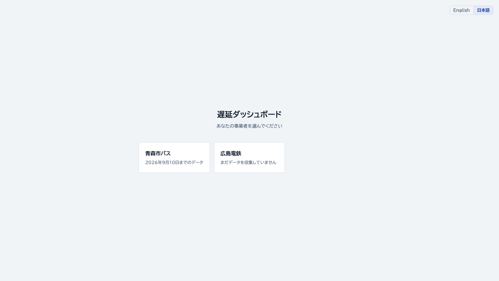

- 各カードには、事業者名と、データがいつまであるか（「…までのデータ」）が表示されます。まだデータが届いていない事業者には「まだデータを収集していません」と表示されます。データのある事業者が先に並びます。
- 事業者が多いときは、カードの上に「事業者を検索」の欄が表示されます。
- 右上の言語の切り替えで、表示する言語を変えられます。

カードをクリックすると、その事業者の**概況**画面（4章）が開きます。選んだ事業者は記憶され、次にアプリを開くと、その事業者の概況から始まります。登録されている事業者が1つだけのときは、この画面は表示されません。

### 事業者を切り替える

サイドバー上部の事業者メニュー（事業者名と▾）を開き、名前の一部を入力して絞り込み、別の事業者を選びます。同じ画面のまま、新しい事業者の内容に切り替わります。路線のページにいたときは、路線は事業者ごとに異なるため、**路線**の一覧に移ります。スマートフォンでは、事業者メニューは**その他**の中にあります。

画面上部の検索欄（2章）に事業者名を入力して切り替えることもできます。

---

## 2. 画面の移動

### サイドバー

画面左のサイドバーに、画面の一覧が並びます。それぞれの画面で、ひとつの種類の問いに答えます。

| 画面 | わかること |
|---|---|
| **概況** | 期間中の運行の様子と、変わったこと |
| **路線** | どの路線が遅れているか・時間通りか、1つの路線を停留所ごとに見るとどうか |
| **時間** | いつ遅れるか：日ごと・時間帯ごと・曜日ごと |
| **要因** | 時間がどこでかかっているか：停留所での停車か、停留所間の走行か |
| **比較** | 路線ごとの平日と土日祝の差、事業者どうしの差 |
| **ライブ** | いま走っている便 |
| **レポート** | 印刷したり人に渡したりする資料：期間のまとめ、協議会向け報告、遅延証明書 |
| **質問** | 用意された質問に、表やグラフで答えます |

「そのほか」の下には、**ヘルプ**（このマニュアル）と**このアプリについて**があります。アプリ名の横の矢印で、サイドバーをアイコンだけに折りたためます。アイコンにカーソルを合わせると、画面の名前が表示されます。

サイドバー下部のアカウントメニュー（お名前、または**ゲスト**）には、ログイン、表示の**言語**、**外観**（システムの設定に合わせる・ライト・ダーク）があります。

### 検索して移動する

各事業者の画面の上部にある「路線・レポート・画面を検索」の欄を押すと、検索ボックスが開きます（ショートカットは Mac では⌘K、それ以外では Ctrl+K）。入力して、画面・事業者・路線・レポート・時間帯へ移動できます。

その横の「…まで集計」は、レポートに含まれる最後の運行日です。クリックすると「データの鮮度」が開き、レポートがいつまでのデータか、最後のライブ受信はいつか、異常値として除外した観測がどれだけあるかを確認できます。観測のない日は定時扱いにせず、集計から外しています。

### スマートフォンでは

画面の幅が狭いときは、サイドバーの代わりに、画面下部のバーに**概況**・**路線**・**ライブ**・**質問**・**その他**が並びます。**その他**には、事業者メニュー、ほかの画面、ヘルプ、アカウントメニューがあります。

### 画面上部のお知らせ

概況・路線・時間・要因・比較の画面では、上部にお知らせが出ることがあります。

- 「データが最新ではありません — 最終取り込み: …」は、1日以上新しい観測が届いていないときに表示されます。データの収集が遅れているだけで、アプリの故障ではありません。×で閉じられます。
- 「フィード健全性」のお知らせは、直近7日間で除外した異常な遅延データ（配信の停止・異常の可能性）の件数を示します。表示中の数値には、それらは含まれていません。

---

## 3. 表示の条件：画面上部の一文

**概況**・**路線**・**時間**・**要因**・**比較**（平日と土日祝）と、**レポート**の期間のまとめ・協議会向け報告・遅延証明書では、画面の上部に、何を集計しているかを1つの文で示します。初期の条件では次のようになります。

> （事業者名）の全路線を、（期間）のすべての曜日・全時間帯で、定時は1分以内として見る

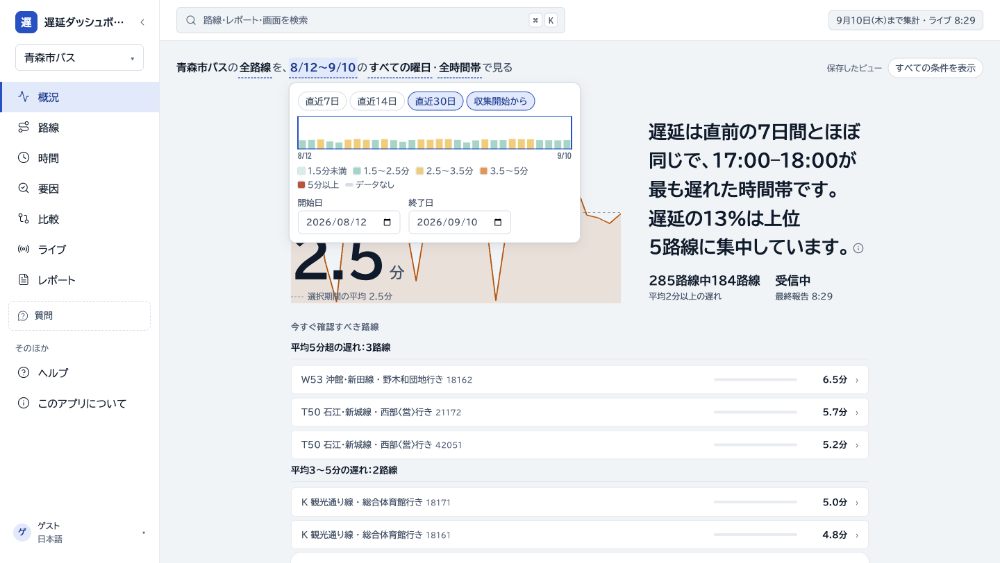

破線の下線が付いた部分が条件です。クリックすると変更でき、画面はすぐに更新されます。

| 条件 | 選べるもの |
|---|---|
| 対象の路線 | 1つ以上の路線、または全路線 |
| 期間 | 「直近7日」「直近14日」「直近30日」「収集開始から」、小さな日別グラフ上でドラッグした範囲、または「開始日」「終了日」の日付 |
| 曜日とダイヤ | 「すべて」「平日」「土日」、または曜日を個別に。「ダイヤの種類」も選べます |
| 時間帯 | 「全時間帯」、または「朝(05-09)」「夕(17-20)」などの時間帯 |
| 定時の幅 | 何分の遅れまでを定時とみなすか（「定時とみなす遅れ」）：1・3・5分。それぞれのときの定時率も表示されます |

初期の期間は、データのある最新の日（1日分そろった日）までの30日間です。期間の選択肢も、その日で終わります。ダイヤの種類や、リンクから指定された停留所・方向・早発の幅は、条件として文に加わります。定時を数えない画面では、文は定時の部分の前で終わります。

文の右側には次のボタンがあります。

- 「保存したビュー ▾」：保存したビューの一覧と、今の条件に名前を付けて保存する「このビューを保存…」があります。保存にはログインが必要です。ログインしていないときは「保存したビュー」とだけ表示され、「ログインで保存」のヒントが出ます。
- 「条件をリセット」：期間以外の条件を変えると表示され、すべての条件を初期の状態に戻します。
- 「すべての条件を表示」：すべての条件の操作部品を、文の下に並べて表示します。もう一度押して切るまで、この表示が続きます。

この画面で使わない条件は取り消し線で表示され、文の下に「この画面では使いません：曜日とダイヤ」のように示されます。たとえば平日・土日祝の系統別遅延のレポートは、曜日を自分で決めています。

条件は画面ごとに記憶されます（このブラウザのタブを開いている間）。そのため、**路線**で期間を変えても、**時間**の期間は変わりません。条件はページのアドレス（URL）にも含まれるので、コピーしたリンクを開くと同じ表示になります。

ライブ・質問・路線のページ・事業者どうしの比較には、それぞれ専用の絞り込みがあります。各章で説明します。

---

## 4. 概況 — 運行のいまを見る

概況は、事業者を選んだときに最初に開く画面です。画面上部の条件の期間をまとめて表示します。

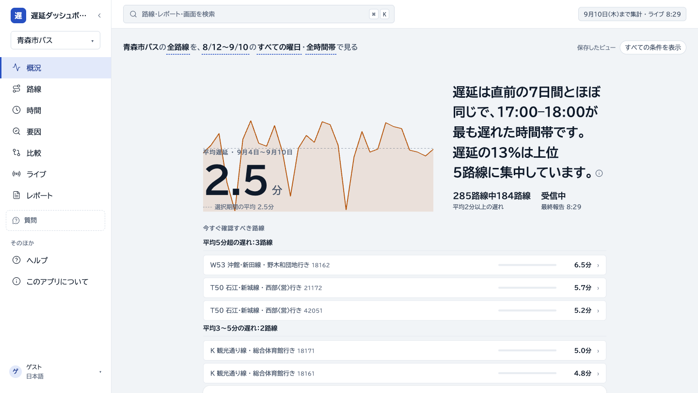

- 「平均遅延 · …」：平均遅延（分）です。背景に、日ごとの値の小さな線が描かれます。横の文は、直前の同じ日数分と比べた変化を示します。ⓘアイコンで比較のしかたを確認できます。
- 「…路線中…路線」：平均で一定の分数以上遅れた路線の数です（「平均…分以上の遅れ」）。
- フィードの状態：「受信中」「フィード停止 …」「まだ受信していません」のいずれかと、最終報告の時刻です。
- **今すぐ確認すべき路線**：遅れの大きい路線を、平均の遅れの大きさごとにまとめて並べます。路線をクリックすると、その路線のページ（5-6）が開きます。「確認が必要な路線はありません」は、該当する路線がないという意味です。
- **遅延の集中度**・**時間帯別の悪化**・**サービス日別**：遅れが一部の路線に集中しているか、どの時間帯が最も遅れるか、平日と土日祝でどう違うかを示します。カードをクリックすると拡大表示します。**時間帯別の悪化**では、時間をクリックすると、その時間帯に遅れた路線の一覧が開きます。

期間内に観測がないときは、その旨と、条件の変え方の提案が表示されます。

---

## 5. 路線 — どの路線が遅れているか

### 5-1. レポートの画面

**路線**・**時間**・**要因**・**比較**（平日と土日祝）は同じ配置です。**レポート**の協議会向け報告と遅延証明書も同じ配置です。

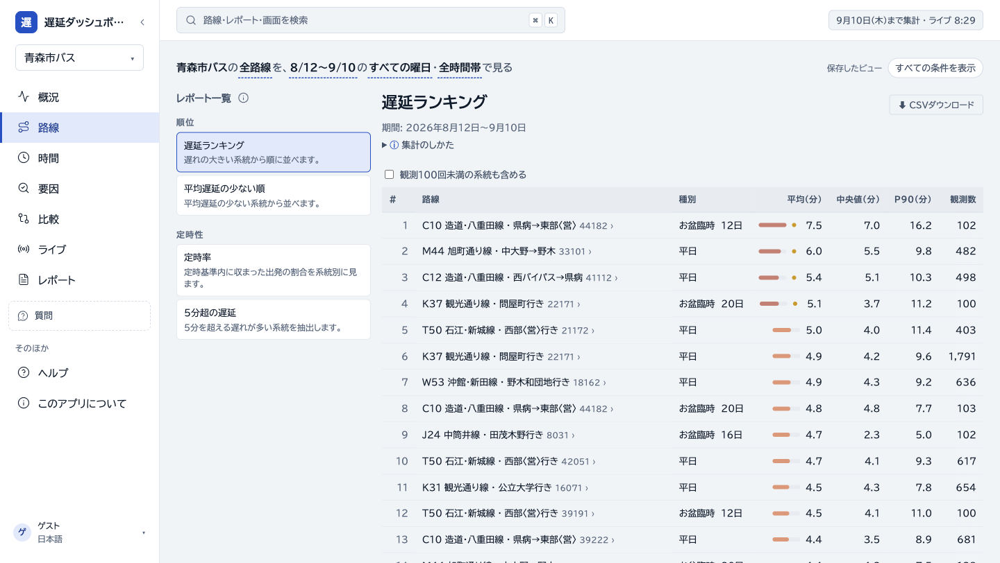

| エリア | 場所 | 内容 |
|---|---|---|
| 表示の条件 | 上部 | レポートが集計している条件（3章） |
| レポート一覧 | 左側 | この画面のレポート。「順位」「定時性」などのグループに分かれ、それぞれに1行の説明が付きます |
| レポート | 中央 | 選んだレポート：表やグラフ、対象の期間（「期間: …」）、書き出せる行があるレポートでは「CSVダウンロード」 |

画面を開くと、一覧の最初のレポートが表示された状態になります。一覧で別のレポートをクリックすると切り替わります。スマートフォンでは、一覧はレポートの上のプルダウンになります。

集計に時間がかかると、数秒後に「まだ処理しています…」と表示されます。期間が1週間より長いときは「まだ処理しています。期間が長いほど集計に時間がかかります。」と表示され、「期間の最後の7日間に絞る」ボタンが出ます。

### 5-2. 読み方に迷ったら ⓘ アイコン

一覧の上の「レポート一覧」の横にある小さなⓘをクリックすると、「レポートの読み分け」というポップアップが開き、レポートの種類ごとの使い道を説明します。

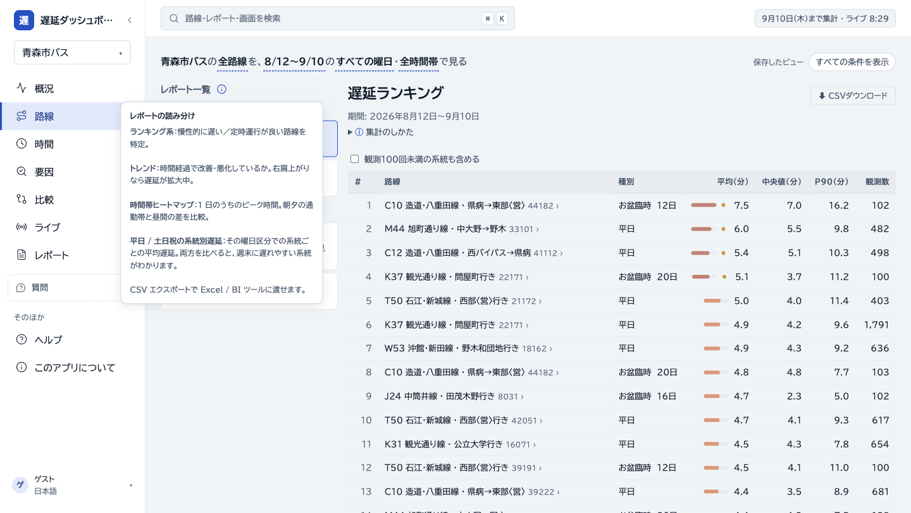

- ランキング系は、慢性的に遅い路線や、定時運行が良い路線を見つけるためのものです。
- トレンドは、改善しているか悪化しているかを見るためのものです。右肩上がりなら遅延が拡大中です。
- 時間帯ヒートマップは、1日のうちのピーク時間を示します。朝夕の通勤帯と昼間の差を比べられます。
- 平日 / 土日祝の系統別遅延は、その曜日区分での系統ごとの平均遅延です。両方を比べると、週末に遅れやすい系統がわかります。
- CSV エクスポートで、Excel や BI ツールにデータを渡せます。

ほかの場所をクリックするか、Esc キーを押すと閉じます。

### 5-3. 路線の画面のレポート

| レポート | 内容 |
|---|---|
| **遅延ランキング** | 遅れの大きい系統から順に並べます |
| **平均遅延の少ない順** | 平均遅延の少ない系統から並べます |
| **定時率** | 定時基準内に収まった出発の割合を系統別に見ます |
| **5分超の遅延** | 5分を超える遅れが多い系統を抽出します |

どこから見ればよいか迷ったら、まず**遅延ランキング**でどの路線が悪いかを確認し、次に**時間**の**トレンド**でいつ悪いかを見るのがおすすめです。

### 5-4. 遅延ランキングの読み方

表の列：

- 「路線」：名前をクリックすると、その路線のページ（5-6）が開きます。
- 「種別」：その便が走った時刻表（平日・土日祝・特別ダイヤなど）です。
- 「平均（分）」：平均遅延です。
- 「中央値（分）」：真ん中の値です。一部の極端な日に引っ張られにくい、典型的な遅れを表します。
- 「p90（分）」：90%の出発は、これ以内の遅れでした。運の悪い日にどれくらい遅れるかの目安です。
- 「観測数」：その行の基になった観測の数です。少ないほど確かさは下がります。

遅延ランキングと平均遅延の少ない順では、期間中の観測が100回未満の系統を外しています。まれにしか走らない特別ダイヤの系統が、わずかな便数だけで上位に来ないようにするためです。「観測100回未満の系統も含める」にチェックを入れると、それらも順位に加わり、観測数に「データ少」のバッジが付きます。表に載りきらない系統があるときは、表の下に表示件数（「…件中…件を表示」）が出て、「すべて表示」で残りも一覧できます。

レポート右上の「CSVダウンロード」で、この表をダウンロードできます。

### 5-5. 定時率と5分超の遅延

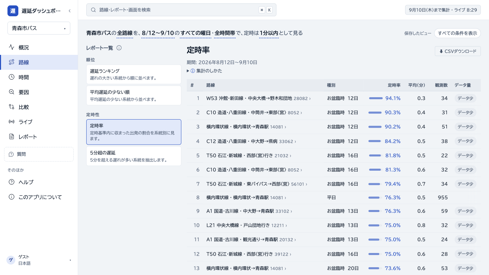

**定時率**は、系統ごとの「定時率」を一覧にします。画面上部の条件にある定時の幅以内に出発した割合で、100%に近いほど良好です。「データ量」の列の「データ少」は、出発の数が少なく、割合を信頼しにくいことを示します。表の下には、計画運行間隔が12分以内の系統を対象とした「運行間隔の質」と、事業者が路線ごとの目標を設定している場合は「最低パフォーマンス基準」が表示されます。

**5分超の遅延**は、系統ごとに、5分を超えて遅れて出発した回数（「5分超回数」）を数えます。

### 5-6. 路線のページ

レポートの路線名、概況の**今すぐ確認すべき路線**、ライブの便の一覧から路線をクリックすると、その路線のページが開きます。

- 上部の「路線 / （路線名）」から一覧に戻れます。ページの見出しの下には、このページの問い「遅れが増えた区間を調べる」が表示されます。
- その下の絞り込み（「路線」「系統」「開始日」「終了日」「曜日」「時間帯」）は、「適用」を押すと反映されます。押すまでは「変更が未適用です」と表示されます。
- 「停留所ごとの遅延」は、停留所ごとの平均出発遅延を示します。「1週間前と比較」にチェックを入れると、1週間前の同じ曜日の値も重ねて表示します。
- 4つのタブ：「路線に沿った遅れ」（停留所ごとの遅れ）、「ダイヤ図」（その路線が最後に運行した日の便ごとの運行）、「地図」、「停留所の表」。「選択した停留所」で停留所を選ぶと、その数値が表示されます。
- 「CSVダウンロード」で、停留所ごとの数値をダウンロードできます。「この分析を保存」で条件をこのブラウザに保存でき、**レポート**の「保存した分析」（10-2）から開き直せます。

数値は、その路線の代表的な運行経路に沿った平均値です。どこで遅れが増えるかは分かりますが、それだけで原因を示すものではありません。

---

## 6. 時間 — いつ遅れるか

時間には、**トレンド**・**平日の系統別遅延**・**土日祝の系統別遅延**・**路線別予測**があります。

### 6-1. トレンド

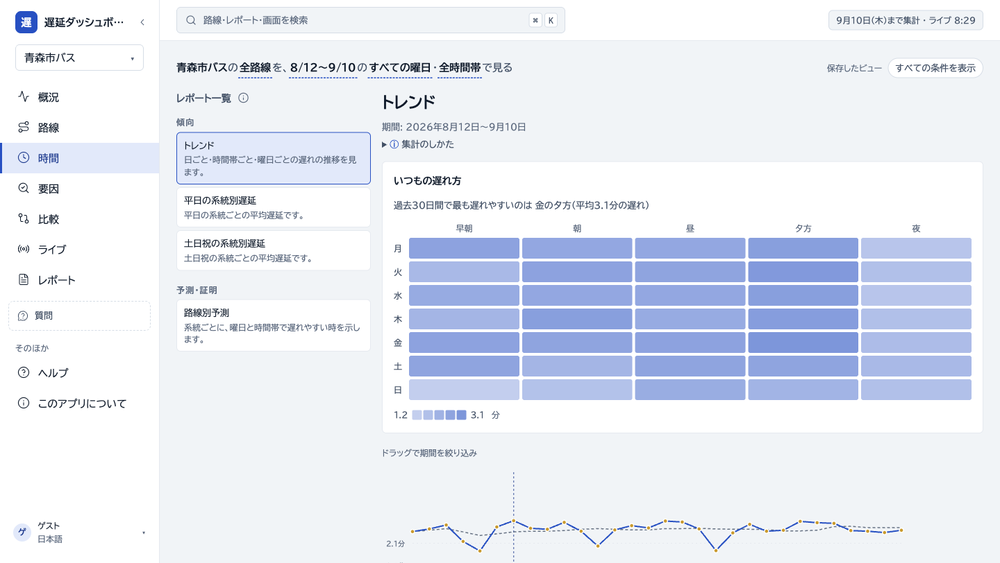

- **いつもの遅れ方**：曜日と時間帯の表です。色が濃いほど遅れが大きく、表の上の文は、期間中に最も遅れやすかった曜日と時間帯を示します。
- 日ごとのグラフ：日ごとの平均遅延の推移です。点線の「7日移動平均」と、新しいダイヤが反映された日の「ダイヤ改正」の印が付きます。右肩上がりなら遅延が拡大中です。グラフ上をドラッグすると期間を絞り込めます（「ドラッグで期間を絞り込み」）。「期間をリセット」で元に戻ります。
- **時間帯ヒートマップ**：縦が時間（0〜23時）、横が日付です。色が濃いほど遅れが大きく、特に遅れの大きいマスには枠線が付きます。マスをクリックすると、その日のその時間帯に絞り込みます。

トレンドには2日以上の期間が必要です。1日だけの期間では時間帯ヒートマップだけが表示され、期間を広げるよう案内が出ます。

### 6-2. 平日の系統別遅延・土日祝の系統別遅延

その曜日区分での、系統ごとの平均遅延（「平均（分）」と「観測数」）です。両方を比べると、週末に遅れやすい系統がわかります。これらのレポートは曜日を自分で決めているため、画面上部の条件で曜日やダイヤの種類を指定していると、使わない条件として表示されます。

### 6-3. 路線別予測

系統ごとに、曜日と時間帯で遅れやすい時を示します。「曜日 × 時間帯（全路線）」で事業者全体を、「遅れやすい路線」で系統の一覧を見られます。系統をクリックするか、「系統」の一覧から選ぶと、その系統の内訳を表示します。

---

## 7. 要因 — データで説明できること

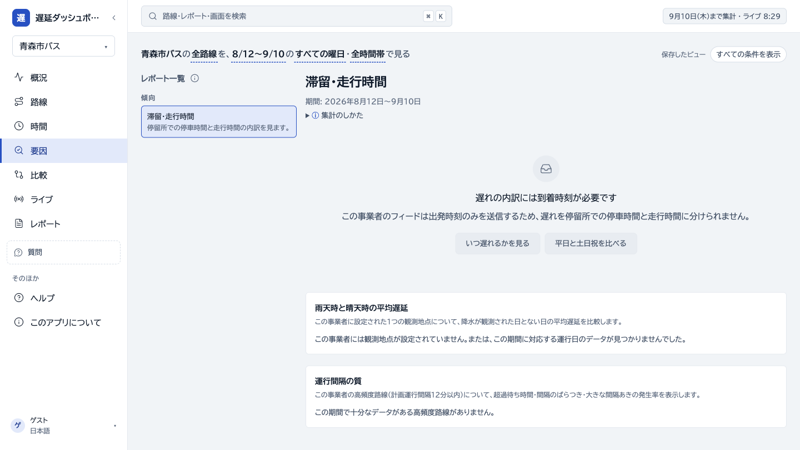

**滞留・走行時間**は、系統ごとの遅れを、停留所での停車時間（「滞留平均」「滞留p50」「滞留p90」）と、停留所間の走行時間（「走行平均」「走行p50」「走行p90」）に分けて、秒単位で示します。それぞれの観測数も表示されます。

- 遅れを分けるには到着時刻が必要です。事業者のフィードが出発時刻しか送っていない場合は「遅れの内訳には到着時刻が必要です」と表示され、「いつ遅れるかを見る」（時間の画面）と「平日と土日祝を比べる」（8-1の比較）のボタンが出ます。
- この内訳は、時間帯を1つに絞っては見られません。時間帯を指定しているとその旨が表示されるので、画面上部の条件で「全時間帯」を選んでください。
- レポートの下には、事業者に気象の観測地点が設定されている場合に、雨の日とそうでない日を比べる「雨天時と晴天時の平均遅延」と、運行頻度の高い系統を対象とした「運行間隔の質」が表示されます。

---

## 8. 比較 — 並べて比べる

上部の2つのボタンで、「平日と土日祝」と「事業者どうし」を切り替えます。

### 8-1. 平日と土日祝

**平日・土日祝の差**は、系統ごとの平日と土日祝の平均遅延（「平日（分）」「土日祝（分）」）を並べ、その差（「差（分）」）と、どちらが大きいか（「向き」：「土日祝>平日」または「平日>土日祝」）を示します。差の大きい系統から並びます。

### 8-2. 事業者どうし

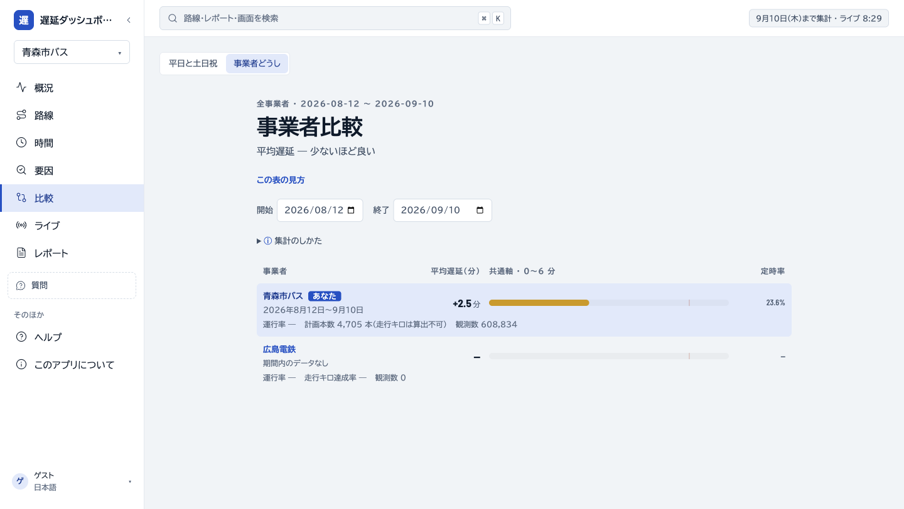

「事業者比較」は、「開始」「終了」で指定した期間のすべての事業者を、平均遅延の大きい順に並べます（「平均遅延 — 少ないほど良い」）。自分の事業者には「あなた」のバッジが付きます。

各行には、共通の軸での「平均遅延（分）」、「定時率」、「運行率」、「走行キロ達成率」、「観測数」と、その事業者がデータを持つ期間が表示されます。「未更新」のバッジは、その事業者の集計がまだ最新のデータに追いついていないことを示します。「この表の見方」で、各数値の意味を確認できます。利用者数の重みが設定されている場合は、「利用者数で重み付け」で、定時率を重み付けした値に切り替えられます。

事業者名をクリックすると、その事業者の**ライブ**画面が開きます。

---

## 9. ライブ — いま走っている便

ライブは、いま報告している便を表示する画面です（見出しは「現在の運行」）。30秒ごとに自動で更新され、「今すぐ更新」ですぐに取得できます。横の「最終更新 …」は最後の報告がいつかを示し、報告が止まっているときは「フィード停止 …」と表示されます。

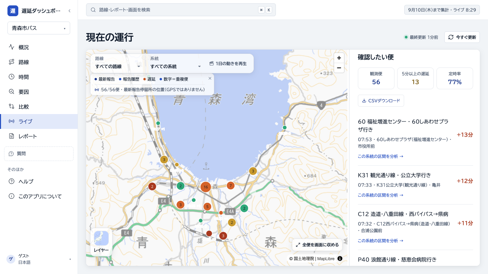

- 地図は、各便を最後に報告した停留所の位置に表示します（GPSの位置ではありません）。凡例で記号の意味を確認できます：「最新報告」「報告履歴」「遅延」「数字＝重複便」。便にカーソルを合わせると詳細が表示され、「この便を固定表示」で表示したままにできます。「全便を画面に収める」で全便が入るように地図を動かし、「レイヤー」で地図のスタイルを切り替えます。
- 地図上の絞り込み：「路線」と「系統」を選び、「適用」を押します。
- 「1日の動きを再生」で、その日の観測を地図上で再生します。「現在の運行に戻る」で現在に戻ります。
- 右側の「確認したい便」：いま報告している便の「観測便」「5分以上の遅延」「定時率」、それらの便の「CSVダウンロード」、5分以上遅れている便の一覧（遅れの大きい順）があります。一覧の各便から、その路線のページに移動できます。「観測便を確認」では、運行中の路線・方面・便を選んで、遅れの推移を確認できます。

報告している車両がないときは、地図に「いま走行を報告している車両はありません」と表示されます。深夜は通常の状態です。運行時間中も続く場合は、事業者のフィードが止まっている可能性があります。

初めてライブを開くと、絞り込み・便の一覧・検索欄を案内する3ステップのツアーが表示されます。「後で」でいったん閉じ、「完了」で終わります。

---

## 10. レポート — 人に渡す資料

上部に3つのタブがあります：「期間のまとめ」「保存した分析」「協議会向けまとめ・遅延証明」。

### 10-1. 期間のまとめ

期間中の運行を、印刷できる一枚にまとめます。画面上部の条件の文に続いて、「期間中の平均遅延」（グラフ）と「系統別の平均遅延」（表。「分析を開く →」でその路線のページが開きます）が並び、それぞれに「CSVダウンロード」があります。右上の「エクスポート」メニューには「PNG画像をダウンロード」「CSVダウンロード」「共有リンクを作成」「印刷 / PDFで保存」があります。下部の「集計条件・定義を見る」から、詳細レポートに移動できます。

欠測は定時運行として扱いません。観測がある期間のみ表示します。

### 10-2. 保存した分析

路線のページの「この分析を保存」で保存した分析です。クリックすると最新のデータで開き直し、「削除」で消せます。このブラウザにだけ保存されるため、別のブラウザや端末には表示されません。

### 10-3. 協議会向けまとめ・遅延証明

左の一覧に、**協議会向け報告**と**遅延証明書**があります。

**協議会向け報告**は、協議会・取締役会向けの期間まとめです。4つの主な数値（「定時率」「平均遅延」「観測した発車」「計画便数」）、文章のまとめと注記、「印刷 / PDFで保存」ボタンがあります。

**遅延証明書**は、乗客に遅延の証明を渡すためのものです。

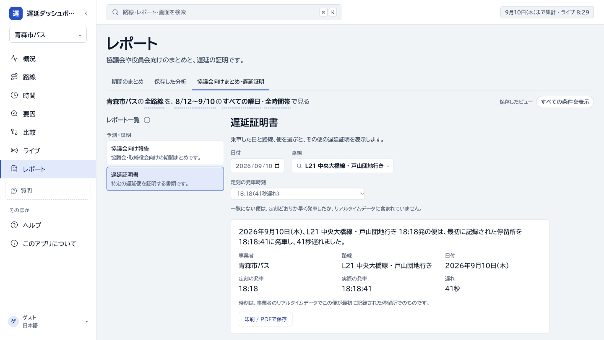

1. 乗車した「日付」と「路線」（「路線を検索」）を選びます。
2. 「定刻の発車時刻」で便を選びます（「便を選択」）。各便には、遅れた時間が表示されます。
3. 証明書が表示されます。文面と「事業者」「路線」「日付」「定刻の発車」「実際の発車」「遅れ」が記載されます。時刻は、事業者のリアルタイムデータでこの便が最初に記録された停留所でのものです。「印刷 / PDFで保存」を押します。

一覧には、遅れて発車した便だけが並びます。一覧にない便は、定刻どおりか早く発車したか、リアルタイムデータに含まれていません。その日にその路線で遅れて発車した便がなければ、その旨が表示されます。

職員向けには、「期間内のすべての遅延便」を開くと、画面上部の条件での全件の一覧と「CSVダウンロード」が表示されます。

---

## 11. 質問 — 用意された質問ですぐ答えを得る

質問は、遅延についてよくある質問に、表やグラフで答える画面です。レポートを探し回らずに答えを得られます。サイドバーの画面一覧の下にある**質問**から開きます。

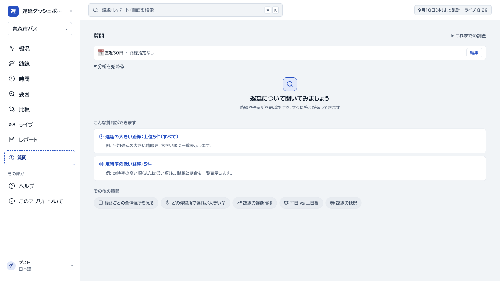

### 11-1. 質問する

- 上部のバーには、質問の対象となる期間と路線が表示されます。「編集」で変更でき（「期間」「曜日」「時間帯」「路線」）、「適用」で確定します。
- 「こんな質問ができます」のカードは、押すとすぐに答えが出ます：「遅延の大きい路線：上位5件（すべて）」「定時率の低い路線：5件」。
- 「その他の質問」は、先に路線を選ぶ質問です：「経路ごとの全停留所を見る」「どの停留所で遅れが大きい？」「路線の遅延推移」「平日 vs 土日祝」「路線の概況」。路線を選び、必要ならほかの設定も変えて「実行」を押します。
- 最初の答えが出た後は、下部の「別の分析を始める」を開くと、すべての質問が並びます。選ぶと、その質問の設定が開きます（遅延の大きい路線の質問なら「件数」と「運行種別」）。

### 11-2. 答えの見方

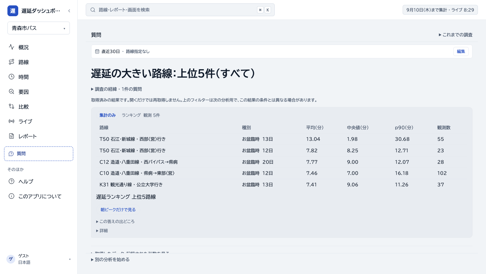

- 答えの見出しは質問で、その下に表やグラフが表示されます。
- 「この答えの出どころ」で、路線・条件・集計方法が分かります。「集計のみ」のバッジは集計から直接算出した値であること、「AI 回答」は取得済みの結果をもとに生成AIが書いた要約であることを示します。
- 答えの下のボタンで、次の一歩を選べます：「朝ピークだけで見る」「地図で見る」「先々週と比べる」「PNGで保存」など。
- 「結果を保存（JSON）」と表ごとのCSVで、答えを保存できます。
- 質問はそれぞれ、調査の1ステップになります。「調査の経緯」で過去の質問を振り返り、「最新の結果に戻る」で最新に戻れます。

### 11-3. 結果について自分の言葉で質問する

お使いのアカウントで利用できる場合は、最新の答えの下に「この結果について質問...」の入力欄が表示されます。文章で質問を入力し、送信ボタン（紙飛行機のアイコン）を押すと、表示中の結果に基づいた答えが返ってきます。入力欄の下の注記のとおり、AIは送信したときだけ動作し、新しいデータは取得せずに、保存済みの結果をもとに答えます。停留所ごとの答えでは、先に停留所を選んでください。

この入力欄は、表示中の結果を深掘りするためのものです。新しいランキングを作るときは、質問のカードを使ってください。答えられなかった場合は、原因（質問が長すぎる、アクセスが集中している、通信が途切れた）に応じたメッセージが表示されます。質問を短くする、少し待つ、もう一度試す、などで対応してください。

入力欄が表示されないときは、お使いのアカウントでは自由入力の質問を利用できません。質問のカードは集計から直接算出するため、そのまま使えます。

### 11-4. これまでの調査

上部の「これまでの調査」に、過去の調査が日付ごとに並びます。検索したり、「新しい調査」で新しく始めたりできます。各調査のメニューから、名前の変更・ピン留め・削除ができます。ログインしていない場合、調査は質問したブラウザにだけ保存されます。

どのレポートを見ればよいか迷ったときは、質問の画面で聞きたいことを選ぶのが早い場合があります。
